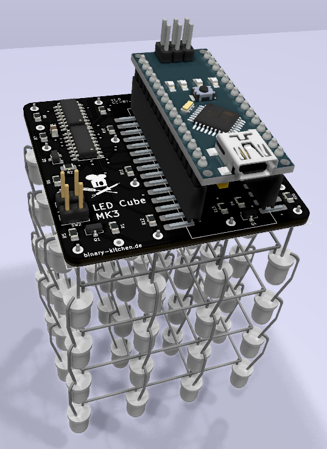
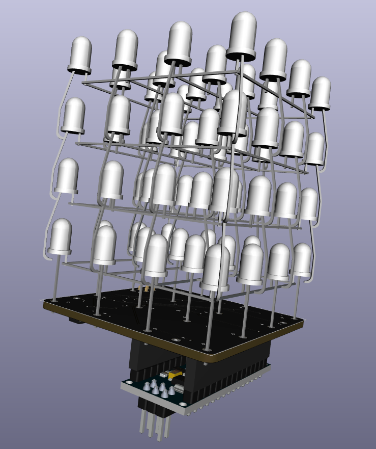

# Programmable LED Cube
A 4x4x4 LED Cube which can be programmed with an arduino nano. A harder soldering challange combining SMD soldering with very fragile LEDs.

## Bill of Material
TBD

## Manual
TBD

## Copyright and Authorship
- Idea/PCB-Layout: [CC-BY-SA 4.0](https://creativecommons.org/licenses/by-sa/4.0/) - [Thomas Schmid and Timo Schindler](https://www.binary-kitchen.de)
- Manual (TeX): [LPPL](https://www.latex-project.org/lppl.txt) - [Marei Peischl](https://peitex.de)
- Manual (pdf): [CC-BY-SA 4.0](https://creativecommons.org/licenses/by-sa/4.0/) - [Binary Kitchen e.V.](https://www.binary-kitchen.de)
